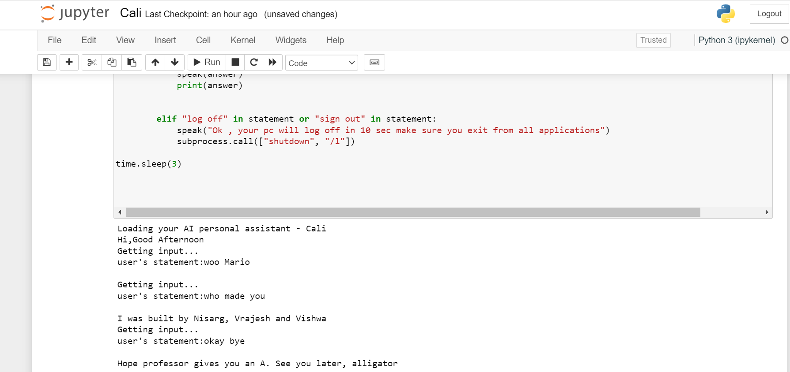
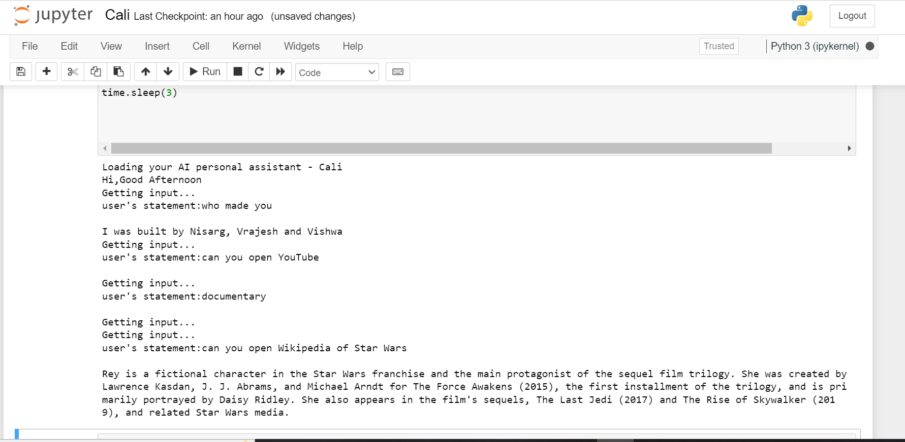

Cali Voice-Enabled Virtual Assistant
====================================

An AI project to build an voice-enabled virtual assistant using Speech
Recognition library of python and Sapi5 library of windows.

### Demo

 

### GIF:

![Cali-gif] (https://github.com/vrajesh007/Cali-Voice-Enabled-Virutal-Assistant/blob/main/Cali-demo2.gif)

### Packages and Libraries are required for installation using Pip install Command:

    1.Speech recognition

    2.Wolfram Alpha

    3.Wikipedia

    4.Json

    5.Pyttsx3

    6.time

    7.Ecapture

    8.request

    9.pipwin, pyaudio

    10. datetime

    11. os

    12. subprocess

### how to run this code:

1.  first clone the repo of
2.  install required packages and libraries using pip install "library"
    command.
3.  run the Cali.py file in your system(windows).

Other way to run the code:

1.  run the py file in your jupyter notebook with the Anaconda
    Navigator.

### About Cali :

Cali can communicate with humans and can able to answer of any
questions. Cali can interpret human commands and carry out normal
client-defined tasks. we built it with jupyter notebook.

A voice assistant is software that may assist users with a variety of
tasks while also saving time. Helps automate several tasks that users
may want to do.

### Cali can carry out the below tasks:

1.  Open wepages : youtube , G-Mail , Google-Chrome , Stack-Overflow

         User : Hey Cali, Open StackOverflow

2.  Current time

         User : Hey Cali , What is the time?

3.  Catch Top headlines from LA times

         User: Can you give me the latest news?

4.  Open Youtube

         User:Hey Cali, Open Youtube

5.  Search content from web

         User: Hey Cali, Search best natural images in USA from Google

6.  can answer computational and geographical questions

         User: Hey Cali, Who is the presidant of USA? / Hey Cali can you add 21000  and 32222?

7.  Can give prediction of Weather for any city

         User: Hey Cali , What is the weather today?
         cali: which city?
         User: Los Angeles

8.  get summary from any wikipedia

         User: Hey Cali , Can you open wikipedia of star wars?

9.  you can ask to cali like Who are you? and Who made you ?

10. good bye greeting to shuting down the Cali:

        User: Okay Bye!

Cali makes use of third - party APIs to forecast weather in several
cities and to answer geographical and computational inquiries. You can
create an account with one of the following applications to get free API
id or keys.

    OpenWeatherMap - To predict weather

    Wolfram|Alpha - To give answer about geographical and computational questions.
